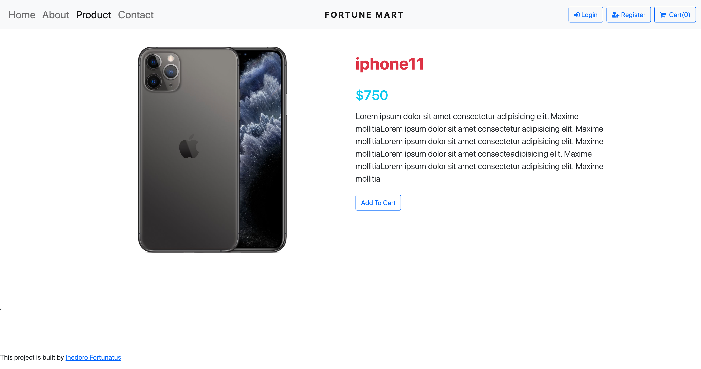

# Fortune Mart
"This is an ecommerce-shop where users can view items, save items on the cart and checkout and make payments for the items.."





## Built With

- JSX, CSS,Bootstrap, JavaScript, React, react-router-dom, react-redux;
- Visual Studio, Git, & GitHub;

## Getting Started

To run this project, you only need a computer with a browser (like Google Chrome, Mozilla Firefox, Microsoft Edge, Apple Safari, etc.) installed, and follow these steps:

1. In your terminal, in the folder of your preference, type the following bash command to clone this repository:

```sh
git@github.com:fortuneonyeka/E-commerce-shop.git
```

2. Now that you have already cloned the repo run the following commands to get the project up and running:
```sh
cd ecommerce-shop
npm install
npm start
```

1. Next, you can start joining missions and booking rockets. All the changes will be automatically updated on your local server on http://localhost:3000/. You can stop your local server at any time hitting `<Ctrl> + C` on your keyboard.

## Author

👤 **Ihedoro Fortunatus O**

- GitHub: [@fortuneonyeka](https://github.com/fortuneonyeka)
- Twitter: [@onyekafortune](https://twitter.com/onyekafortune)
- LinkedIn: [Ihedoro Fortunatus](https://www.linkedin.com/in/fortunatus-ihedoro/)

## 🤝 Contributing

Contributions, issues, and feature requests are welcome!

## Show your support

Give a ⭐️ if you like this project!